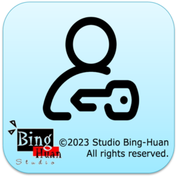
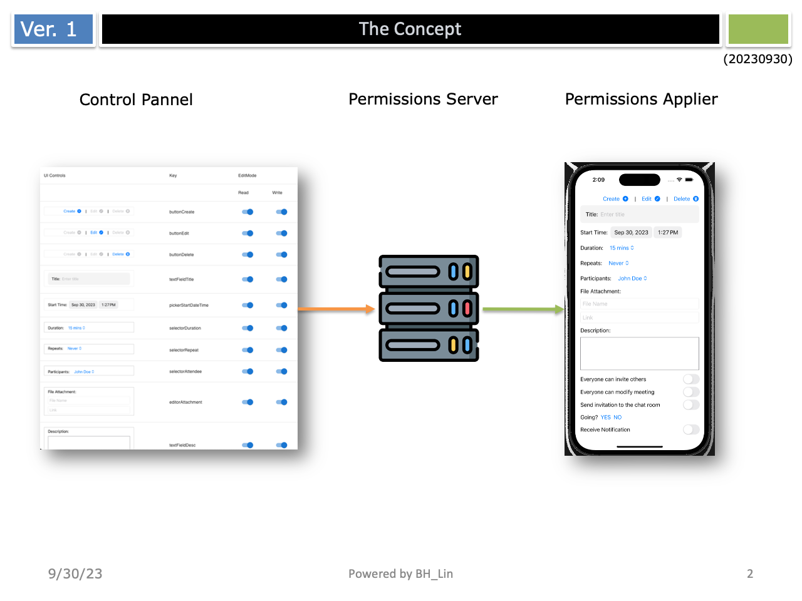
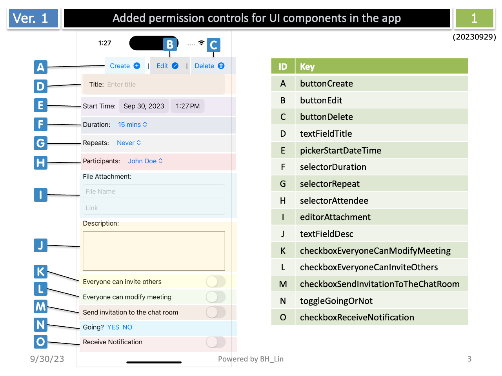
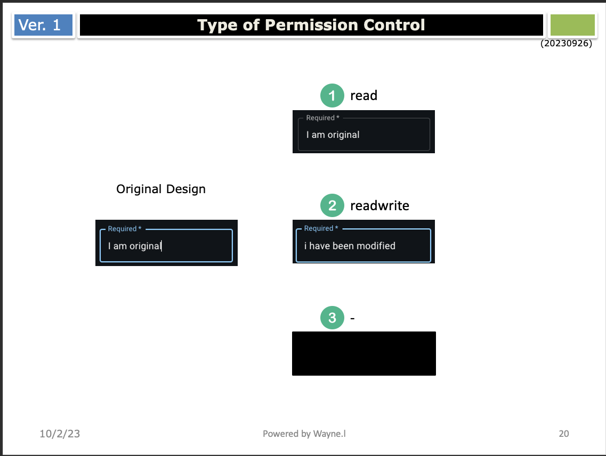
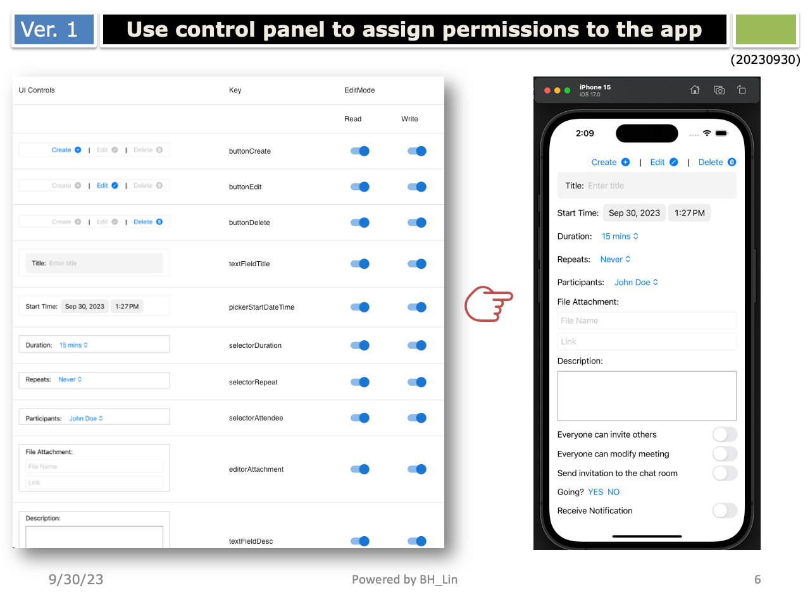
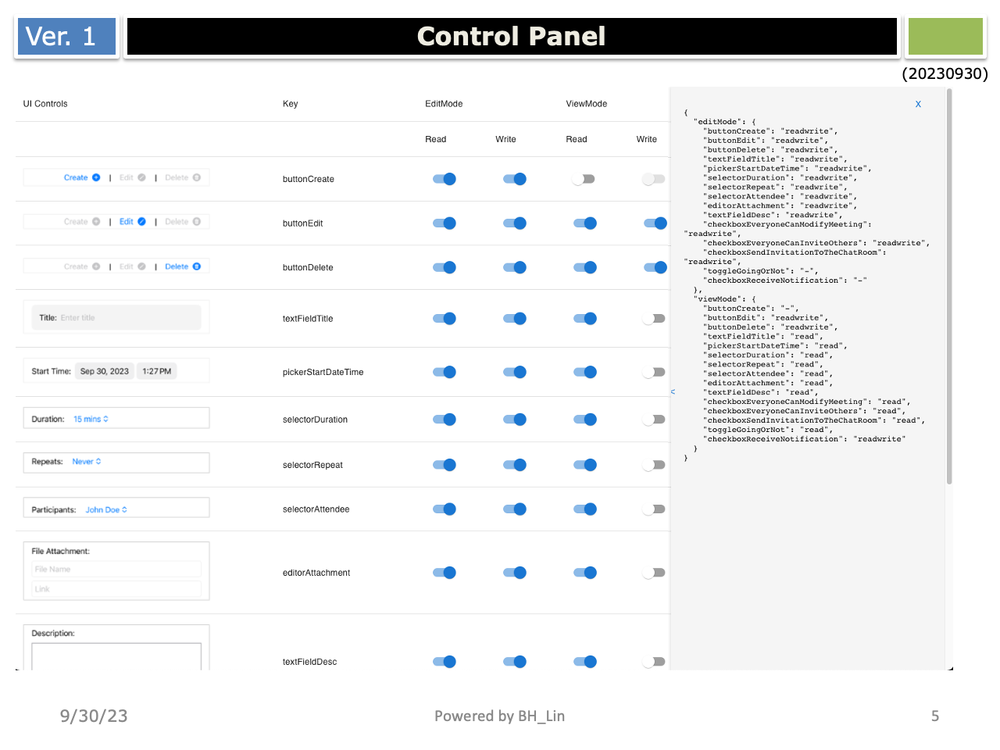
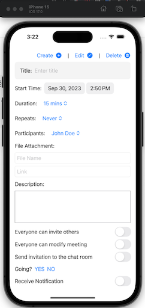
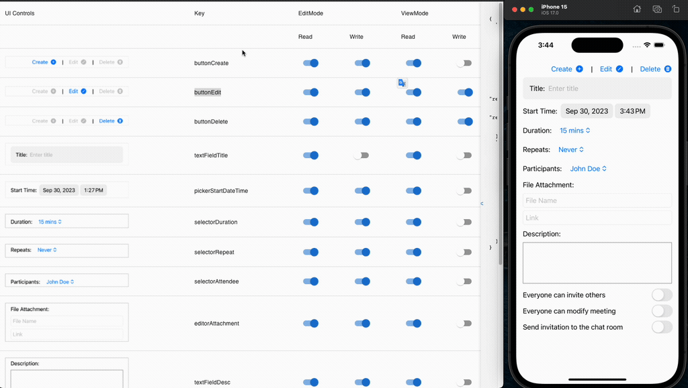
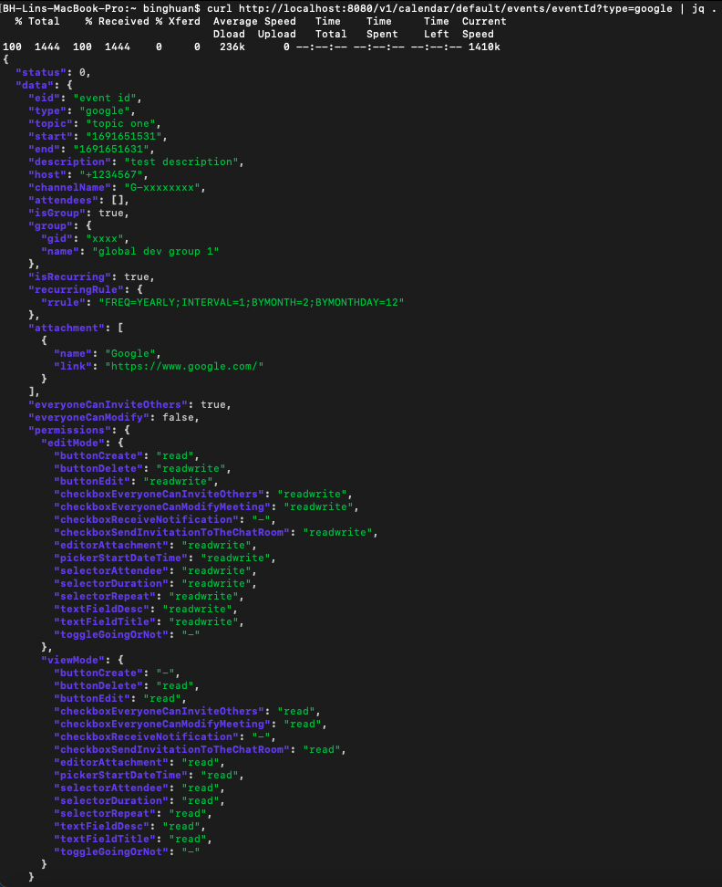

  
permission-control-demo
================================================

I created this "Demo Permission Control" to show you how permissions are returned from the server to the application, and the application uses them for ui controls.

## Table of Contents

- [permission-control-demo](#permission-control-demo)
  - [Table of Contents](#table-of-contents)
  - [System Design](#system-design)
  - [Keys for UI Controls](#keys-for-ui-controls)
  - [Types of Permission Control](#types-of-permission-control)
  - [Usage](#usage)
  - [How to start the Control Panel Web App](#how-to-start-the-control-panel-web-app)
  - [How to start the server](#how-to-start-the-server)
  - [How to start the mobile App](#how-to-start-the-mobile-app)
  - [How to start the electron app](#how-to-start-the-electron-app)
  - [Demo](#demo)
  - [How to test the server](#how-to-test-the-server)
  - [Risks of Permission Control on Mobile Devices](#risks-of-permission-control-on-mobile-devices)
  - [Q: How do I determine who should handle the current button permissions?](#q-how-do-i-determine-who-should-handle-the-current-button-permissions)
    - [Answer from ChatGPT:](#answer-from-chatgpt)


## System Design 


## Keys for UI Controls 


## Types of Permission Control 


## Usage


## How to start the Control Panel Web App 
```bash
cd ControlPannelWebApp
yarn install
yarn start
``` 
You will see this when the web application starts.  


## How to start the server
```bash
cd PermissionServer
go run main.go
``` 


## How to start the mobile App
```bash
cd iPermTaker-iOS
open iPermTaker.xcodeproj
```
or you can just click the xcode project to open it.  
  


## How to start the electron app
```bash
sudo npm install foreman -g 
cd ipermission-taker-electron-app
yarn install 
nf start
```

## Demo 


## How to test the server
1st, start the server  
2nd, run following command to test the server
```bash
curl http://localhost:8080/v1/calendar/default/events/eventId?type=google | jq .
```


## Risks of Permission Control on Mobile Devices
## Q: How do I determine who should handle the current button permissions?
For example, The iOS device has scheduled a meeting that cannot be edited, cannot invite, and does not send messages. Both Mac and iOS devices click on the meeting boot notification to the details page without an edit button, but the Android device has an edit button and can edit the "permit" option to the chat room.

### Answer from ChatGPT:
The problem description involves the issue of inconsistent permission displays on different devices (iOS, Android, Mac). Below are suggestions on how to distinguish who should handle button permissions:

- **Basic Principle**: Permissions should always be determined by the server side. The server knows the user, the user's role, meeting details, and related permission rules. The server should return a clear set of permissions for each meeting, specifying which actions the user can perform.
  
- **UI Presentation**:
  - The APP side (whether it's iOS, Android, or Mac) should decide whether to display the edit button or other buttons based on the set of permissions returned by the server.
  - No permission rules should be hardcoded on the client side. For example, you shouldn't write in the iOS code "if the user is this role, then display the edit button". Instead, it should be "if the server says the user can edit, then display the edit button".
  
- **Handling Inconsistency**:
  - If iOS and Mac do not display the edit button, but Android does, then it may be a bug on the Android side. In this case, Android developers need to check how they handle the set of permissions returned by the server.
  - Another possibility is that the set of permissions returned by the server to different devices is inconsistent. This could be a server-side bug.
  
- **Testing**: Comprehensive testing is recommended to ensure permissions are implemented correctly on all devices. Create different meeting and user scenarios, and then test the display and functionality of permissions on all devices.
  
- **Detailed Error Reporting**: When receiving problem reports as described, it should be as detailed as possible. For instance, the report should include:
  - The device used and the version of the operating system.
  - The complete set of permissions returned by the server.
  - The actual UI seen on the device.
  - Any other potentially relevant information, such as user roles, meeting details, etc.
  
- **Continuous Communication**: Front-end and back-end developers should communicate regularly to ensure they both understand the rules and logic of permissions. When there are new permission requirements or changes, all device APPs should be updated promptly.

In summary, button permissions should be determined by the server and implemented consistently on all client devices. Inconsistencies across different devices are usually caused by client or server-side bugs and need to be addressed through detailed testing and communication.
